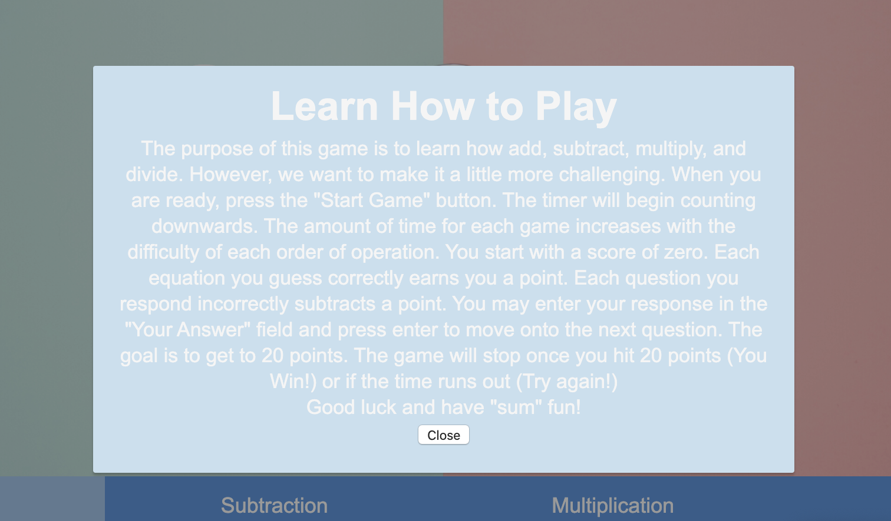
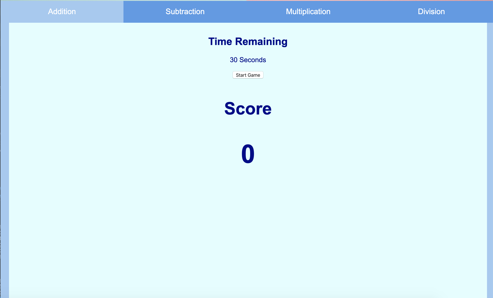
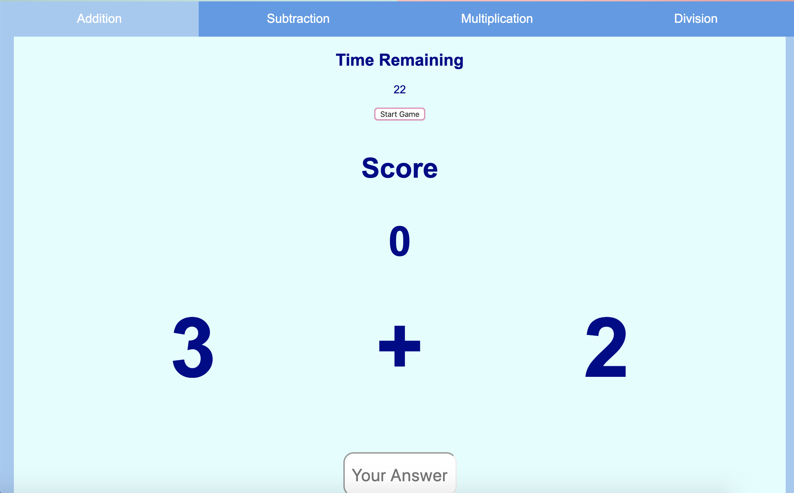
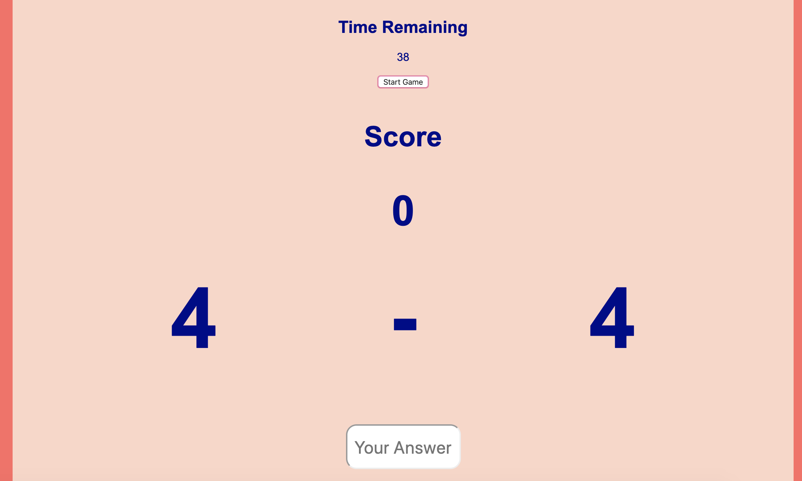
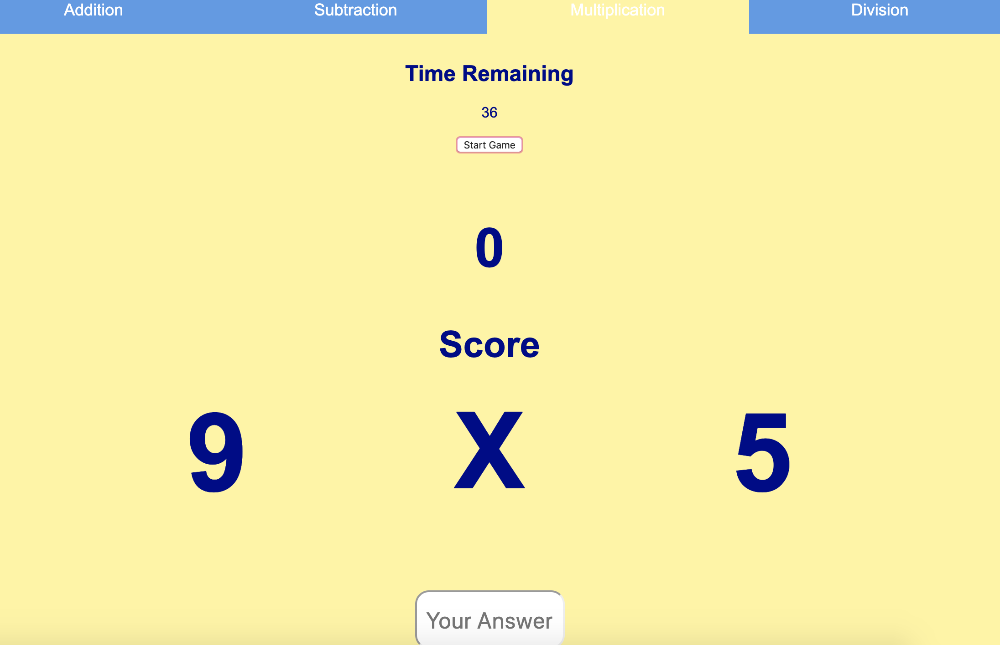
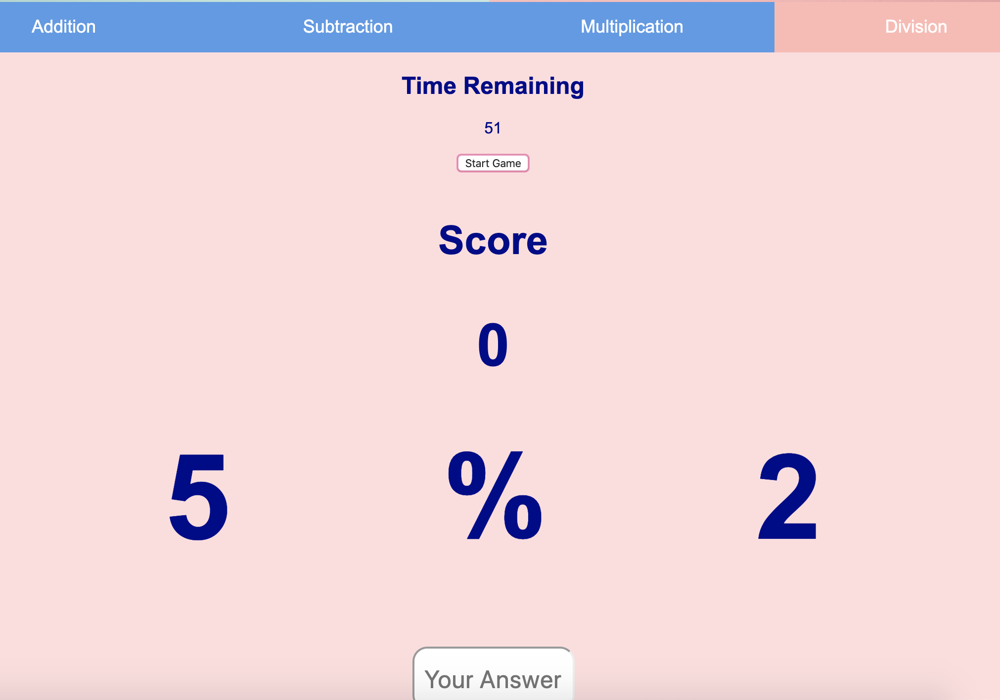
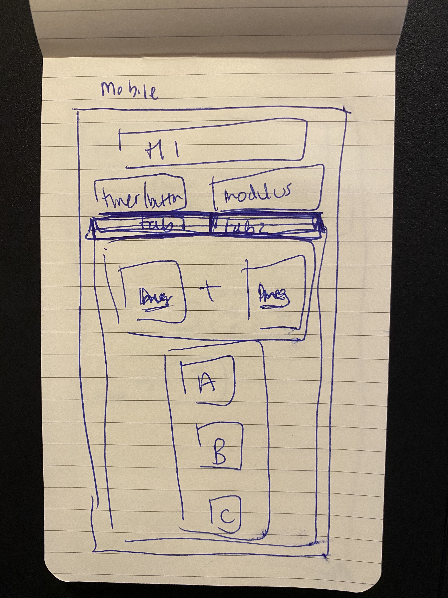
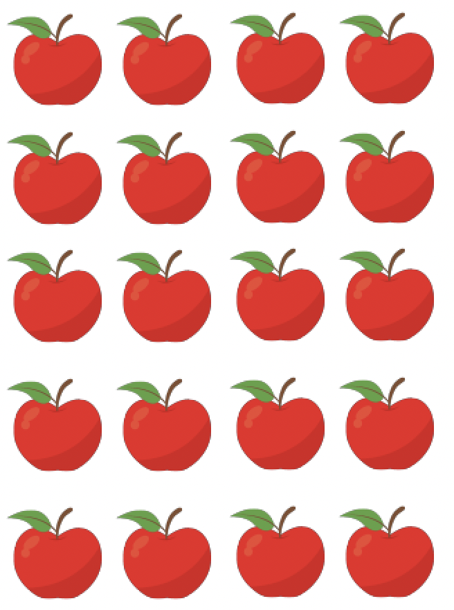

# Countless Countdown


## Concept 

Countless Countdown is a game that challenges users to practice their basic math knowledge in a competitive yet fun manner. This game is designed to increase in difficulty with each basic math operation. However, user will also have more time to solve each problem as the game becomes more difficult. The user must reach 20 points before the time runs out. 

## Technologies used
1. HTML
2. CSS
3. Javascript
4. JQuery

## Approach
### Wireframe 


#### Step One - Creating the HTML and CSS
I created the HTMl with the different div classes for each element I wanted on the page. I created four tabs for each math operation, in addition to the main header and footer image. There is also a modal that allows user to learn the game rules.



#### Step Two - Organizing code within each tab

I placed each game into an iFrame to break up my code. 

``` html
        <div id="addition" class="content">
            <iframe src="../mathGame/Games/Addition/index.html" frameborder="0"></iframe>
        </div>

        <div id="subtraction" class="content">
            <iframe src="../mathGame/Games/Subtraction/index.html" frameborder="0"></iframe>
        </div>

        <div id="multiplication" class="content">
            <iframe src="../mathGame/Games/Multiplication/index.html" frameborder="0"></iframe>
        </div>

        <div id="division" class="content">
            <iframe src="../mathGame/Games/Division/index.html" frameborder="0"></iframe>
        </div>
```

#### Step Three - Creating the first mini game
I game designing each "mini-game" by starting with the "Addition" problem. 

I created a button for the user to start the game, which triggers the timer to start and two random numbers to generate, using javascript and jquery functions. 
 
 ``` javascript

        const $generatesNewNumber = () => {
            if (score === 20) {                            
                alert("We have a winner!");              
                score = 0;                               
                $cumulativeScore.html(`<span>${score}</span>`);     
                $("#input-container, .equation").css("display", "none");      
                clearInterval(myTimer);  
                sec = 30                     
            } else {
                firstRandomNumber = $generateRandomNumber(10);  
                $("#newVal").text(firstRandomNumber);           
                secondRandomNumber = $generateRandomNumber(10); 
                $("#secondNewVal").text(secondRandomNumber)     
            }
        }
```

The game score is initially set to zero. 

The user is able to put their response into the input form and submit using the "enter" button. I initially had a submit button but realized this would be too time consuming if the had to move their mouse with each submission. 

Once the response is submitted, a condition is placed to determine if the response if correct or incorrect. 

 ``` javascript
        let correctAnswer = firstRandomNumber + secondRandomNumber
        if (parseInt(userInput, 10) === correctAnswer) {    
            $("#inputBox").val('');   
            addScore();                
        } else {
            minusScore();          
        }
 ```

If the response was correct, the score would add one to the base score of 0.

If the response was incorrect, the score would subtract 1 fom the initial score. 

The random numbers will regenerate until the time either runs out (alerting user the game is over) or until the user reaches 20 points (alerting user they have won). Once the game is either won or lost, the input option is hidden, to prevent th user from continuing the game. The user must then continue by hitting the "start game" button again. 



 

 #### Step 4 - Creating other mini games

For the **subtraction** and **multiplication** games - The concept and code for the each game is overall the same. However, I did increased the users time to complete the game from 30 seconds to 45 seconds as these operations can be more challenging. 




For the **division** game- I increased the users time complete the game to 60 seconds. I also changed the random number generator function so that the second number generated cannot be a 0, as to avoid "error" in division.

``` javascript
        const $generateSecondNumber = (min, max) => {
        let secondNum = Math.floor(Math.random() * (max - min) + min); 
        return secondNum
}
```

 Lastly, instead of parsing the integers like I did with the addition, subtraction and multiplication games, I used the "eval" option so that the user is able to submit fractions and decimals without the response being incorrect. 




## Challenges
### First attempt




* I initially tried to add images of apples to make the game more kid friendly. The idea was to have the user get two images of apples, and find the solution from an array of three images. However, I realized based on the time I was giving the user, it would be difficult to count all the apples quickly. Additionally, based on the screen size, it would be hard to get all the images into one row. 



Lastly, this would have only been applicable to the array of images I had used, and could not further expand into other math operations/problems. 

### Creating Tabs
* Creating the different tabs was very challenging as I initially tried to put all the code for each tab under each section. This became a very large JS file with very similar code in each section. I was able to break it apart by putting each game into a separate iFrame. 


### Timing restraints 
* I ran out of time to add sound to the game once the clock starts and to complete the responsive design.

### Image path
* I tried to add all my images into one folder to keep the sources more organized. However, my `README` was not able to recognize it unless all the images were on the same level a my index.html.

## App Demo 
Please take a look at my project 
[Countless Countdown](https://zchen92.github.io/mathGame/)

## Acknowledgements 
Big thanks to Madeline O'moore, Bruno DaSilva, Arthur Bernier Jr, and "Nando" Tavarez with helping me put this game together.


